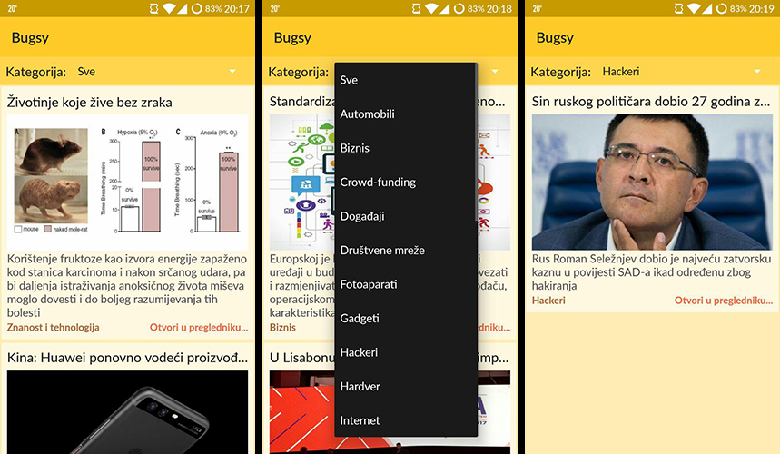

Bugsy - app for reading news from bug.hr
=================================
Faculty of Electrical Engineering, Computer Science and Information Technology Osijek  
Mobile platform application development  
Fourth Homework

## Requirements

* Create Activity with RecyclerView/ListView
* Implement adapter
* Create layout for items in RecyclerView/ListView
* Implement content refresh (Pull to refresh/Button)
* Implement category filter

## Screenshots

## Resources

* [Retrofit documentation](http://square.github.io/retrofit/)
* [Simple XML serialization documentation](http://simple.sourceforge.net/)
* [Icon](https://icons8.com/)
